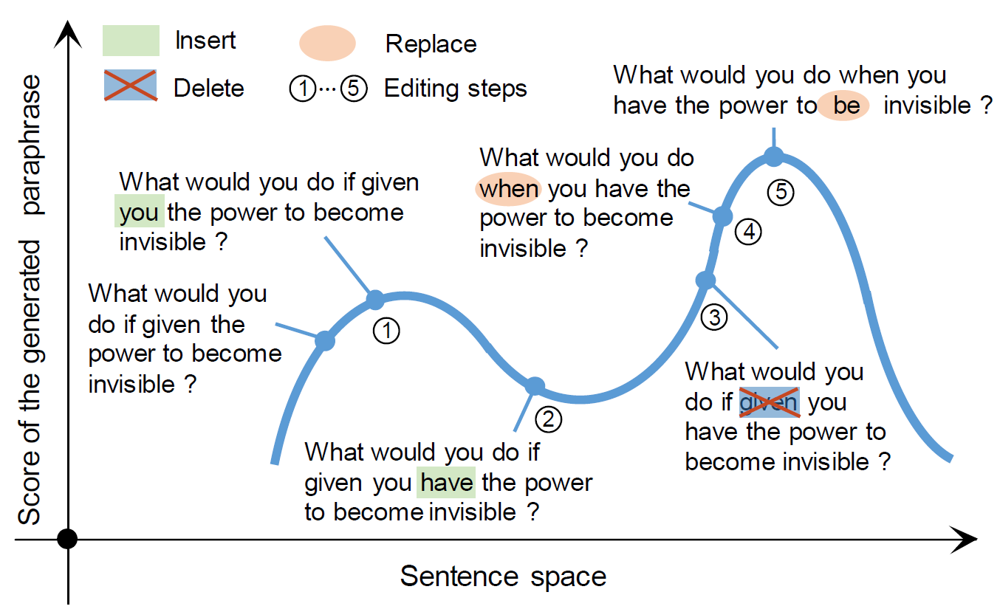

# UPSA

# Requirement
python==2.7
cuda 9.0
## python packages
	nltk
	TensorFlow == 1.3.0
	numpy
	pickle
	Rake (pip install python-rake)
	zpar (pip install python-zpar, download model file from https://github.com/frcchang/zpar/releases/download/v0.7.5/english-models.zip and extract it to POS/english-models)

# run the code:
python source/run.py --exps_dir exps-sampling  --exp_name  test   --use_data_path data/quoradata/test.txt --mode kw-bleu  --N_repeat 1  --save_path sa.txt   --batch_size 1 --gpu 0  --search_size 50

# evaluation script
python  source/evaluate.py --reference_path quora-results/ref.txt  --generated_path  quora-results/gen.txt

# Computational Time
To evaluate the generation speed of each method, we have compared the average number of generated paraphrases of each model within a minute with either CPU (eight Intel Core i7-4790K CPUs) or GPU (NVIDIA GeForce GTX TITIAN X GPU) settings. In particular, for each method, we use a well-trained model to produce 20,000 paraphrases (with a batch size of 20) and record the consumed time. The results are shown in the following table.

|Model| # samples/minute on GPU | # samples/minute on CPUs | 
|:--:|:--:|:--:|
|VAE|1309.61|88.72|
|Lag. VAE|1275.20|87.29|
| CGMH | 20.36|5.11|
| UPSA | 40.28 |10.93|

